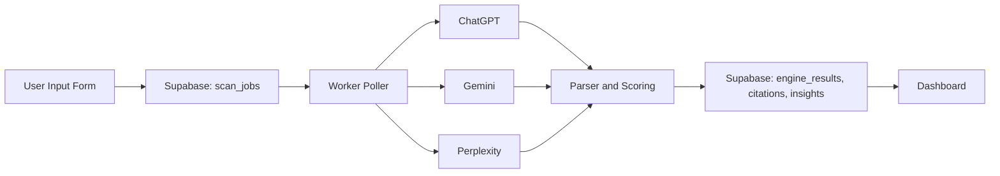

# VISIBI — AI Visibility Analytics Platform
Track where your brand appears inside AI conversations across ChatGPT, Gemini, and Perplexity.

VISIBI is an AI Visibility Intelligence Platform that analyses:
- Brand mentions  
- Citations  
- Sentiment  
- Competitor presence  
- Content patterns  
…all based on your brand name, domain, and seed topics.

This repository contains the full **MVP implementation** of VISIBI, including documentation, backend worker logic, Supabase schema, and frontend dashboard.

---

# 🚀 Features (MVP)

### ✔ Submit a brand + domain + email + up to 5 seed topics  
### ✔ Runs visibility analysis across:
- **OpenAI ChatGPT**
- **Google Gemini 1.5 Pro**
- **Perplexity Sonar**

### ✔ Extracts:
- Brand mentions  
- Citation links  
- Competitor domains  
- Sentiment  
- Content formats (review, guide, product page)

### ✔ Computes:
- Visibility Score (0–100)
- Topic-level rankings
- Competitor share of voice

### ✔ Dashboard Includes:
- Bar chart (visibility per engine & topic)
- Donut chart (competitor SOV)
- Citations table
- Content insights
- CSV export

---

# 🧠 How VISIBI Works (Overview)

1. User submits brand, domain, topics  
2. Supabase creates a `scan_job`  
3. Python worker picks up the queued job  
4. For each (topic × engine):  
   - Visibility prompt  
   - Sentiment prompt  
   - Content insights prompt  
   - Extracts citations, competitors, ranking, sentiment  
5. Worker stores all results into Supabase  
6. Dashboard displays aggregated insights  

---

# 🏗️ System Architecture

